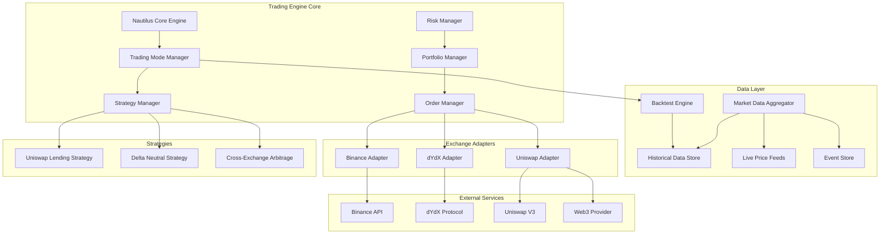

# Design Document

## Overview

The crypto algo-trading engine will be built on the Nautilus framework, providing a high-performance, event-driven architecture for systematic strategy development through backtesting, paper trading, and live trading modes. The system will execute sophisticated trading strategies across centralized exchanges (Binance) and decentralized protocols (Uniswap, dYdX), with a modular design that supports seamless transitions between trading modes while maintaining strategy logic, execution engines, risk management, and data feeds.

## Architecture

### High-Level Architecture



### Component Architecture

The system follows a layered architecture with the following key components:

1. **Nautilus Core Engine**: The foundation providing event-driven execution, backtesting, and live trading capabilities
2. **Strategy Layer**: Implements specific trading algorithms (Uniswap lending, delta-neutral)
3. **Execution Layer**: Handles order routing, execution, and position management
4. **Data Layer**: Manages market data feeds, historical data, and event storage
5. **Adapter Layer**: Provides standardized interfaces to different exchanges and protocols

## Components and Interfaces

### Core Engine Components

#### Trading Mode Manager
- **Purpose**: Manages transitions between backtesting, paper trading, and live trading modes
- **Key Methods**:
  - `set_trading_mode(mode: TradingMode) -> None`
  - `get_current_mode() -> TradingMode`
  - `validate_mode_transition(from_mode: TradingMode, to_mode: TradingMode) -> bool`
  - `promote_strategy_to_live(strategy_id: str) -> None`

#### Strategy Manager
- **Purpose**: Orchestrates multiple trading strategies and manages their lifecycle across all trading modes
- **Key Methods**:
  - `register_strategy(strategy: Strategy) -> None`
  - `start_strategy(strategy_id: str) -> None`
  - `stop_strategy(strategy_id: str) -> None`
  - `get_strategy_performance(strategy_id: str) -> PerformanceMetrics`
  - `run_backtest(strategy_id: str, start_date: datetime, end_date: datetime) -> BacktestResults`

#### Risk Manager
- **Purpose**: Monitors portfolio risk and enforces risk limits across all strategies
- **Key Methods**:
  - `check_position_risk(position: Position) -> RiskAssessment`
  - `enforce_portfolio_limits() -> None`
  - `calculate_var(confidence: float) -> Money`
  - `emergency_shutdown() -> None`

#### Order Manager
- **Purpose**: Routes orders to appropriate venues and manages execution based on current trading mode
- **Key Methods**:
  - `submit_order(order: Order) -> OrderId`
  - `cancel_order(order_id: OrderId) -> None`
  - `get_order_status(order_id: OrderId) -> OrderStatus`
  - `route_order(order: Order) -> Venue`
  - `simulate_order_execution(order: Order) -> SimulatedFill` (for paper trading)

#### Backtest Engine
- **Purpose**: Executes strategies against historical data with realistic market simulation
- **Key Methods**:
  - `run_backtest(strategy: Strategy, start_date: datetime, end_date: datetime) -> BacktestResults`
  - `load_historical_data(instruments: List[Instrument], start_date: datetime, end_date: datetime) -> MarketData`
  - `simulate_market_impact(order: Order, market_state: MarketState) -> ExecutionResult`
  - `calculate_transaction_costs(order: Order, venue: Venue) -> Money`

### Exchange Adapters

#### Binance Adapter
- **Purpose**: Interfaces with Binance REST and WebSocket APIs
- **Capabilities**:
  - Spot and futures trading
  - Real-time market data
  - Account information and positions
  - Order book depth

#### dYdX Adapter
- **Purpose**: Interfaces with dYdX perpetual protocol
- **Capabilities**:
  - Perpetual contract trading
  - Position management
  - Funding rate monitoring
  - Cross-margin calculations

#### Uniswap Adapter
- **Purpose**: Interfaces with Uniswap V3 protocol via Web3
- **Capabilities**:
  - Liquidity provision and removal
  - Pool information and analytics
  - Gas estimation and optimization
  - LP token management

### Strategy Implementations

#### Uniswap Lending Strategy
```python
class UniswapLendingStrategy(Strategy):
    def __init__(self, pool_addresses: List[str], target_apy: float):
        self.pools = pool_addresses
        self.target_apy = target_apy
        self.positions = {}
    
    def on_market_data(self, data: MarketData) -> None:
        # Analyze pool metrics and adjust positions
        pass
    
    def calculate_optimal_liquidity(self, pool: Pool) -> LiquidityParams:
        # Calculate optimal token ratios and amounts
        pass
```

#### Delta Neutral Strategy
```python
class DeltaNeutralStrategy(Strategy):
    def __init__(self, hedge_ratio: float, rebalance_threshold: float):
        self.hedge_ratio = hedge_ratio
        self.rebalance_threshold = rebalance_threshold
        self.long_positions = {}
        self.short_positions = {}
    
    def maintain_delta_neutrality(self) -> None:
        # Calculate current delta and rebalance if needed
        pass
    
    def execute_hedge_trades(self, delta_imbalance: float) -> None:
        # Execute offsetting trades across venues
        pass
```

## Data Models

### Trading Mode Models

```python
from enum import Enum

class TradingMode(Enum):
    BACKTEST = "backtest"
    PAPER = "paper"
    LIVE = "live"

@dataclass
class BacktestResults:
    strategy_id: str
    start_date: datetime
    end_date: datetime
    total_return: Decimal
    sharpe_ratio: Decimal
    max_drawdown: Decimal
    win_rate: Decimal
    total_trades: int
    avg_trade_duration: timedelta
    transaction_costs: Money

@dataclass
class SimulatedFill:
    order_id: OrderId
    fill_price: Decimal
    fill_quantity: Decimal
    fill_time: datetime
    slippage: Decimal
    transaction_cost: Money
```

### Core Trading Models

```python
@dataclass
class Position:
    instrument: Instrument
    side: PositionSide
    quantity: Decimal
    avg_price: Decimal
    unrealized_pnl: Money
    venue: Venue
    strategy_id: str
    is_simulated: bool = False  # True for paper trading

@dataclass
class Order:
    instrument: Instrument
    side: OrderSide
    quantity: Decimal
    price: Optional[Decimal]
    order_type: OrderType
    time_in_force: TimeInForce
    strategy_id: str
    trading_mode: TradingMode

@dataclass
class LiquidityPosition:
    pool_address: str
    token0: Token
    token1: Token
    liquidity_amount: Decimal
    tick_lower: int
    tick_upper: int
    fees_earned: Money
    impermanent_loss: Money
    is_simulated: bool = False
```

### DeFi-Specific Models

```python
@dataclass
class UniswapPool:
    address: str
    token0: Token
    token1: Token
    fee_tier: int
    liquidity: Decimal
    sqrt_price_x96: int
    tick: int
    apy: float

@dataclass
class FundingRate:
    instrument: Instrument
    rate: Decimal
    timestamp: datetime
    venue: Venue
    next_funding_time: datetime
```

## Error Handling

### Exception Hierarchy

```python
class TradingEngineError(Exception):
    """Base exception for trading engine errors"""
    pass

class ExchangeConnectionError(TradingEngineError):
    """Raised when exchange connection fails"""
    pass

class InsufficientFundsError(TradingEngineError):
    """Raised when account has insufficient funds"""
    pass

class RiskLimitExceededError(TradingEngineError):
    """Raised when risk limits are exceeded"""
    pass

class Web3TransactionError(TradingEngineError):
    """Raised when Web3 transaction fails"""
    pass
```

### Error Recovery Strategies

1. **Connection Failures**: Implement exponential backoff with jitter for reconnection attempts
2. **Transaction Failures**: Retry with adjusted gas prices for blockchain transactions
3. **Risk Violations**: Immediate position closure and strategy suspension
4. **Data Feed Issues**: Fallback to alternative data sources
5. **Partial Fills**: Intelligent order management to handle remaining quantities

### Circuit Breakers

- **Portfolio Loss Limit**: 5% daily loss triggers emergency shutdown
- **Position Size Limit**: Maximum 10% of portfolio per position
- **Leverage Limit**: Maximum 3x leverage across all positions
- **Volatility Circuit Breaker**: Suspend trading when VIX equivalent exceeds threshold

## Testing Strategy

### Unit Testing
- **Strategy Logic**: Test each strategy's decision-making algorithms
- **Risk Calculations**: Verify risk metrics and limit enforcement
- **Order Routing**: Test order routing logic and venue selection
- **Data Processing**: Validate market data parsing and normalization

### Integration Testing
- **Exchange Connectivity**: Test all exchange adapter implementations
- **Cross-Strategy Interactions**: Verify strategies don't conflict
- **End-to-End Workflows**: Test complete trade execution flows
- **Error Scenarios**: Test system behavior under various failure conditions

### Backtesting Framework
- **Historical Data**: Use comprehensive historical data for all venues (OHLCV, order book, funding rates)
- **Strategy Performance**: Measure risk-adjusted returns, drawdowns, and trading metrics
- **Slippage Modeling**: Realistic transaction cost modeling based on historical spreads
- **Market Impact**: Model market impact for large orders using historical volume data
- **Gas Cost Simulation**: Accurate gas cost modeling for DeFi operations
- **Multi-timeframe Testing**: Support for different backtesting timeframes and granularities

### Paper Trading Framework
- **Live Data Integration**: Real-time market data with simulated order execution
- **Realistic Fill Simulation**: Order fills based on current market conditions and liquidity
- **Portfolio Tracking**: Maintain accurate simulated portfolio state and P&L
- **Performance Validation**: Compare paper trading results with backtest predictions
- **Risk Monitoring**: Apply same risk controls as live trading
- **Promotion Criteria**: Define clear criteria for promoting strategies to live trading

### Live Trading Validation
- **Gradual Rollout**: Start with small position sizes and gradually increase
- **Performance Monitoring**: Real-time monitoring of all metrics with comparison to paper trading
- **Automated Alerts**: Immediate notification of performance degradation or anomalies
- **Circuit Breakers**: Automatic fallback to paper trading if performance degrades

### Performance Testing
- **Latency Requirements**: Sub-100ms order execution
- **Throughput Testing**: Handle 1000+ orders per second
- **Memory Usage**: Efficient memory management for long-running processes
- **Stress Testing**: System behavior under extreme market conditions